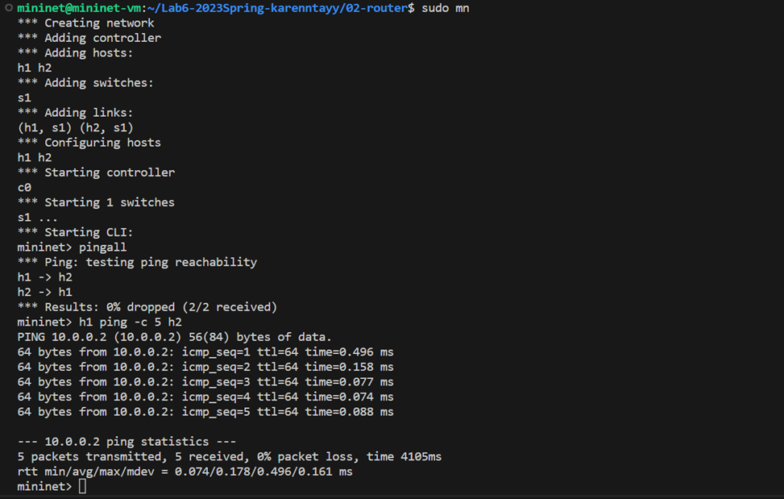

02-router
=============

My name: 郑凯琳 TAY KAI LIN

My Student ID: 205220025

This lab took me about 76 hours to do.

Implementation Explanation:

<u>**arp.c**</u>

这些函数实现了发送 ARP 请求和应答，处理接收到的 ARP 包，并通过 ARP 缓存查找和更新目标 MAC 地址。

**（1）`arp_send_request`**
功能：发送 ARP 请求。
思路：
1.  为 ARP 请求数据包分配内存空间。
    函数使用 `malloc` 动态分配足够的内存空间来存储以太网头部（`ether_header`）和 ARP 数据包（`ether_arp`）。
2.  设置以太网头部（`ether_header`）。将源 MAC 地址（`iface->mac`）复制到以太网头部的源 MAC 字段（`ether_shost`）。将目标 MAC 地址设置为广播地址（`ff:ff:ff:ff:ff:ff`）。将以太网类型设置为 ARP 协议（`ETH_P_ARP`）。
3.  设置 ARP 数据包（`ether_arp`）。设置硬件类型（`arp_hrd`）为以太网类型。设置协议类型（`arp_pro`）为 IPv4 协议类型。设置硬件地址长度（`arp_hln`）为以太网地址长度。设置协议地址长度（`arp_pln`）为 IPv4 地址长度。将操作码（`arp_op`）设置为 ARP 请求（`ARPOP_REQUEST`）。将源 MAC 地址（`iface->mac`）复制到 ARP 数据包的源 MAC 字段（`arp_sha`）。将源 IP 地址（`iface->ip`）复制到 ARP 数据包的源 IP 地址字段（`arp_spa`）。将目标 MAC 地址字段（`arp_tha`）设置为零。将目标 IP 地址（`dst_ip`）复制到 ARP 数据包的目标 IP 地址字段（`arp_tpa`）。
4.  使用 `iface_send_packet` 函数发送 ARP 请求数据包。将网络接口（`iface`）、数据包和数据包大小作为参数传递给 `iface_send_packet` 函数，以发送数据包。
5.  释放动态分配的内存空间。使用 `free` 函数释放之前分配的数据包内存空间。

**(2) `arp_send_reply`**
功能：发送 ARP 回复报文。
思路：
1.  通过动态内存分配申请足够大小的内存来存储以太网头部和 ARP 数据包。
2.  根据 ARP 请求包中的信息，构建 ARP 回复包：
    - 复制请求包中的源 MAC 地址到回复包的目标 MAC 地址字段。
    - 复制接收到的 ARP 请求包中的源 MAC 地址到回复包的源 MAC 地址字段。
    - 设置以太网类型为 ARP 类型(0x0806)。
    - 设置 ARP 数据包的各个字段：硬件类型(ARPHRD_ETHER)、协议类型(ETH_P_IP)、硬件地址长度(6)、协议地址长度(4)、ARP操作为回复操作(2)。
    - 将本地接口的 MAC 地址和 IP 地址分别复制到回复包的源 MAC 地址字段和源 IP 地址字段。
    - 将请求包中的源 MAC 地址和源 IP 地址复制到回复包的目标 MAC 地址字段和目标 IP 地址字段。
3.  调用 `iface_send_packet` 函数将构建的 ARP 回复包发送出去。

**(3) `handle_arp_packet`**
功能：处理接收到的 ARP 报文。
思路：
1.  通过指针运算和偏移量将收到的字符数组 `packet` 转换为 `ether_arp` 结构体指针 `arp_pkt`，
    以便于访问 ARP 数据包的字段。
2.  使用 `ntohl` 和 `ntohs` 函数将目标 IP 地址和操作码字段从网络字节序转换为主机字节序，
    并将转换后的值分别存储在 `target_ip` 和 `arp_op` 变量中。
3.  进行条件判断，检查目标 IP 地址是否与当前接口的 IP 地址相匹配。
4.  如果目标 IP 地址与接口 IP 地址相匹配，根据操作码的值进行进一步处理：
    - 如果操作码为 ARP_REPLY，调用 `arpcache_insert` 函数将源 IP 地址和源 MAC 地址插入到 ARP 缓存中。
    - 如果操作码为 ARP_REQUEST，调用 `arp_send_reply` 函数发送 ARP 回复。

解析接收到的 ARP 数据包，然后根据目标 IP 地址和操作码的值来确定下一步的操作。
如果目标 IP 地址与接口 IP 地址匹配，根据操作码的不同执行相应的操作。

<u>**arpcache.c**</u>

**(1) `arpcache_lookup`** 
功能：在 ARP 缓存中查找指定的 IP 地址对应的 MAC 地址。
思路：
1.  通过调用 `pthread_mutex_lock` 函数获取互斥锁，以确保在遍历 ARP 缓存表时的线程安全性。
2.  使用 `for` 循环遍历 ARP 缓存表中的每个条目。
3.  对于每个条目，检查其 IP 地址和有效性。如果找到与给定 IP 地址匹配且有效的条目，执行以下操作：
    - 使用 `memcpy` 函数将该条目的 MAC 地址复制到传入的 `mac` 数组中。
    - 释放互斥锁，然后返回 1，表示找到了匹配的条目。
4.  如果遍历完整个 ARP 缓存表仍未找到匹配的条目，则释放互斥锁并返回 0，表示未找到匹配的条目。

遍历 ARP 缓存表，查找与给定 IP 地址匹配且有效的条目。
如果找到匹配的条目，则将其 MAC 地址复制到传入的数组中，并返回 1。
如果未找到匹配的条目，则返回 0。
函数内部使用互斥锁确保在多线程环境下的安全性。

**(2) `arpcache_append_packet`** 
功能：将待发送的数据包追加到 ARP 缓存中。
思路：
1.  锁定 ARP 缓存：
    - 函数开始时，使用互斥锁在 ARP 缓存上获取锁定。
    - 这确保只有一个线程同时访问缓存，防止数据不一致。
2.  检查现有条目：
    - 函数遍历存储在 ARP 缓存中的待处理 ARP 请求列表。
    - 检查是否已存在与函数参数中的 IP 地址和接口（`iface`）相同的条目。
3.  追加到现有条目：
    - 如果找到现有条目，则表示已为给定的 IP 地址和接口发送了 ARP 请求。
    - 在这种情况下，函数创建一个新的数据包条目（`struct cached_pkt`），使用提供的数据包和长度初始化它。
    - 然后将数据包条目追加到现有条目的缓存数据包列表（`cached_packets`）的末尾。
4.  创建新条目：
    - 如果找不到现有条目，则函数继续在 ARP 缓存中创建一个新条目。
    - 为新的 `struct arp_req` 条目分配内存，初始化其字段（接口、IP 地址、时间戳和重试次数），并初始化一个空列表以用于缓存的数据包。
5.  追加到新条目：
    - 创建新条目后，函数创建一个新的数据包条目（`struct cached_pkt`），
    - 使用提供的数据包和长度初始化它。
    - 然后将数据包条目添加到新条目的缓存数据包列表的末尾。
6.  将新条目添加到 ARP 缓存：将新条目添加到 ARP 缓存的待处理请求列表（`req_list`）的末尾。
7.  解锁 ARP 缓存：最后，函数释放对 ARP 缓存的锁定，允许其他线程访问它。
8.  发送 ARP 请求：在解锁缓存后，函数调用 `arp_send_request` 函数，为指定的 IP 地址和接口发送 ARP 请求。

通过将数据包追加到现有条目或在必要时创建新条目来高效管理 ARP 缓存。
通过根据 IP 地址和接口组织数据包，代码改进了在后续操作中检索和处理数据包的能力。

**(3) `arpcache_insert`** 
功能：将IP地址和对应的 MAC 地址插入 ARP 缓存中，并处理等待的数据包。
思路：
1.  函数获取对全局 ARP 缓存的互斥锁，以确保在操作 ARP 缓存时的线程安全性。
2.  函数遍历现有的 ARP 缓存条目，查找与给定 IP 地址相匹配的条目。
    如果找到匹配的条目，函数会更新该条目的 MAC 地址，并更新添加时间。
3.  如果没有找到匹配的条目，则函数会寻找空闲的条目或最早添加的条目来存储新的 IP-MAC 映射。
    通过维护一个变量记录最早添加的时间和空闲索引，可以减少遍历次数。
4.  更新或替换条目：函数将新的 IP 地址和 MAC 地址存储到找到的空闲索引处，并更新添加时间和有效标志。
5.  函数处理等待的数据包。遍历等待请求列表中的每个请求条目，如果请求的 IP 地址与插入的 IP 地址相匹配，
    则将等待的数据包中的目标 MAC 地址设置为新的 MAC 地址，并通过适当的接口发送数据包。
6.  函数释放等待请求列表中已处理的请求条目和数据包的内存，以及全局 ARP 缓存的互斥锁。

**(4) `arpcache_sweep`** 
功能：定期清理 ARP 缓存并处理待处理的数据包。
思路：
1.  使用 `while` 循环使函数周期性地执行。
2.  使用 `sleep(1)` 函数使线程每隔1秒执行一次。
3.  在执行期间获取对 `arpcache` 的互斥锁，以确保线程安全。
4.  遍历ARP缓存表中的每个条目，检查其存在时间是否超过15秒，如果是则将该条目标记为无效。
5.  遍历待处理的ARP请求列表，检查每个请求的条件。
    - 如果ARP请求已经发送了5次且没有接收到回复：
        - 则对每个待处理的数据包发送 ICMP 目标主机不可达的消息，
        - 并将数据包从列表中删除。
    - 如果 ARP 请求已经发送了1秒但没有接收到回复：
        - 则重新发送 ARP 请求，
        - 并更新相关计数器和时间戳。
6.  在处理完所有请求后，释放对 `arpcache` 的互斥锁。

定期清理过期的 ARP 缓存条目并处理待处理的 ARP 请求，以确保网络正常运行和通信的顺利进行。

<u>**icmp.c**</u>

`icmp_send_packet` 
功能：构造并发送 ICMP 报文。
思路：
1.  根据传入的类型判断是否为回复 ICMP 类型（ICMP_ECHOREPLY）。
    - 如果是回复类型，直接将传入的数据包内容复制到发送的报文中，长度为 `len`。
    - 如果不是回复类型，需要构造 ICMP 报文。首先根据传入的数据包解析出其 IP 头部（`in_pkt_iphdr`）。
2.  根据类型和代码，计算出发送报文的长度（`packet_len`）。
3.  使用 `malloc` 函数为发送报文分配内存空间。
4.  复制数据包的以太网头部（Ethernet Header）信息到发送报文的以太网头部。
5.  复制数据包的 IP 头部信息到发送报文的 IP 头部，并设置源 IP 地址为当前接口的 IP 地址。
6.  复制 ICMP 头部和数据到发送报文的对应位置。
    - 如果不是回复类型，需要将复制的数据部分设置为 0，
    - 并将原始数据包（`in_pkt`）中的 IP 头部和后续 8 个字节复制到发送报文中。
7.  计算 ICMP 报文的校验和，并将校验和值设置到发送报文的 ICMP 头部。
8.  调用 `ip_send_packet` 函数发送构造好的 ICMP 报文。
9.  释放分配的内存空间，防止内存泄漏。

<u>**ip_base.c**</u>

**(1) `longest_prefix_match`** 
功能：在路由表中查找与给定目标 IP 地址具有最长前缀匹配的路由表项。
思路：
1.  遍历路由表中的每个路由表项。
2.  对于每个路由表项，检查目标 IP 地址与路由表项的目的地址按位与操作后是否相等，即判断是否存在前缀匹配。
3.  如果存在前缀匹配，比较当前路由表项的掩码长度与已经找到的具有最长前缀匹配的路由表项的掩码长度。
4.  如果当前路由表项的掩码长度更长，则更新具有最长前缀匹配的路由表项为当前路由表项。
5.  最终返回具有最长前缀匹配的路由表项。

根据输入的目标 IP 地址，在路由表中找到与其具有最长前缀匹配的路由表项，用于确定数据包的下一跳接口。

**(2) `ip_send_packet`** 
功能：发送由路由器自身生成的 IP 数据包，通常用于发送 ICMP 报文。
思路：
1.  从输入参数 `packet` 中解析出 IP 头部（`iphdr`）。
2.  将目的 IP 地址（`daddr`）转换为主机字节顺序（网络字节顺序转换为主机字节顺序），
    得到目的 IP 地址 `dest_ip`。
3.  使用 `longest_prefix_match` 函数查找最匹配的路由表项 `rt_dest`，
    该表项具有与目的 IP 地址 `dest_ip` 相同且最长的前缀。
4.  如果路由表项 `rt_dest` 的下一跳网关（`gw`）存在，则调用 `iface_send_packet_by_arp` 函数，
    通过 ARP 解析下一跳网关的 MAC 地址，并发送数据包。
5.  如果路由表项 `rt_dest` 的下一跳网关（`gw`）不存在（直接连接到目标网络），则调用 `iface_send_packet` 函数，
    直接发送数据包。

`ip_send_packet` 函数根据目的 IP 地址查找最匹配的路由表项，
然后根据表项的下一跳网关情况选择发送方式，通过 ARP 解析或直接发送数据包。

<u>**ip.c**</u>

这段代码实现了处理 IP 数据包的函数。

`handle_ip_packet(iface_info_t *iface, char *packet, int len)`: 处理接收到的 IP 数据包。
1.  解析数据包，获取 IP 头部结构体 `iphdr`。
2.  检查 IP 协议字段是否为 ICMP。
3.  如果是 ICMP 协议：
    - 获取 ICMP 类型字段。
    - 如果是 ICMP 回显请求且目的 IP 地址与接口的 IP 地址相同，则发送 ICMP 回显应答。
    - 否则，日志记录并将数据包转发。
4.  获取目的 IP 地址，并使用 `longest_prefix_match` 函数在路由表中查找匹配的路由表项。
5.  如果找到匹配项：
    - 如果 TTL 小于等于 1，则发送 ICMP 生存期超时报文并返回。
    - 将 TTL 减一，并重新计算 IP 校验和。
    - 如果下一跳网关为 0，则通过接口直接发送数据包，否则通过 ARP 解析发送数据包。
6.  如果没有找到匹配项，发送 ICMP 目的网络不可达报文。

根据数据包的类型和目的 IP 地址执行相应的操作：回复 ICMP 回显请求、转发数据包或发送 ICMP 目的网络不可达报文。

Screenshots:

Remaining Bugs:

