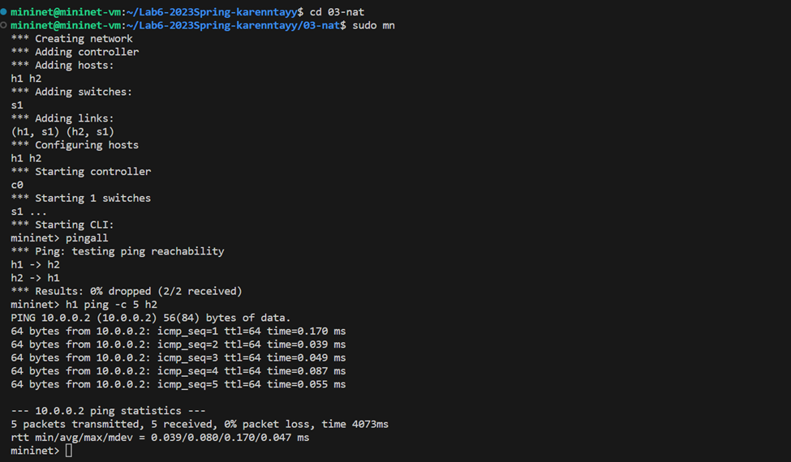

03-nat
=============

My name: 郑凯琳 TAY KAI LIN

My Student ID: 205220025

This lab took me about 70 hours to do.

Implementation Explanation:

**（1） `get_packet_direction(char *packet)`** 
功能：确定给定数据包的方向，即数据包是进入 NAT（Network Address Translation）还是离开 NAT，或者是无效方向。
思路：
1.  从给定的数据包中提取 IP 头部信息，使用函数 `packet_to_ip_hdr`。
2.  使用 IP 头部信息中的源地址（`saddr`）进行最长前缀匹配，以确定数据包的路由目的地。
3.  根据最长前缀匹配结果判断数据包的方向：
-   如果匹配的路由接口的索引与 NAT 的内部接口索引相等，表示数据包是从 NAT 的内部接口离开，即出向流量，返回 `DIR_OUT`。
-   否则，表示数据包是进入 NAT，即入向流量，返回 `DIR_IN`。
4.  如果无法确定数据包的方向，则返回 `DIR_INVALID`。

根据数据包的源地址和 NAT 的内部接口来判断数据包的方向，以便在 NAT 转换过程中正确处理数据包的源和目的地址。

**(2) `do_translation(iface_info_t *iface, char *packet, int len, int dir)`** 
功能：为给定的数据包进行转换，包括替换 IP 和端口，重新计算 IP 和 TCP 校验和，并更新 TCP 连接的统计信息。
思路：
1.  获取数据包的 IP 头部和 TCP 头部指针，使用函数 `packet_to_ip_hdr` 和 `packet_to_tcp_hdr`。
2.  根据数据包的方向（入向或出向）确定哈希表的索引值，通过对源地址或目的地址进行字节序转换和哈希计算得到，`hash_address` 表示转换后的地址，`hash_i` 表示哈希表的索引。
3.  获取对应哈希表索引的链表头部指针 `head`。
4.  根据数据包的方向进行不同的转换逻辑：
    a.  对于入向流量：
    -   在哈希表链表中查找是否存在与数据包的目的 IP 和端口相匹配的映射项（`mapping_entry`），如果找到则标记为已找到。
    -   如果没有找到匹配的映射项，则创建新的映射项并添加到哈希表链表中。
    -   更新 TCP 头部的目的端口为映射项的内部端口，IP 头部的目的 IP 地址为映射项的内部 IP 地址。
    -   更新映射项的外部 FIN 标志和外部序列号。
    -   如果 TCP 头部的标志位为 ACK，则更新映射项的外部 ACK 序号。
    b.  对于出向流量：
    -   在哈希表链表中查找是否存在与数据包的源 IP 和端口相匹配的映射项（`mapping_entry`），如果找到则标记为已找到。
    -   如果没有找到匹配的映射项，则创建新的映射项并添加到哈希表链表中。
    -   更新 TCP 头部的源端口为映射项的外部端口，IP 头部的源 IP 地址为映射项的外部 IP 地址。
    -   更新映射项的内部 FIN 标志和内部序列号。
    -   如果 TCP 头部的标志位为 ACK，则更新映射项的内部 ACK 序号。
5.  重新计算 TCP 校验和和 IP 校验和。
6.  更新映射项的更新时间为当前时间。
7.  释放互斥锁，以确保对共享资源的访问是线程安全的。
8.  使用 `ip_send_packet` 函数将转换后的数据包发送出去。

在 NAT 转换过程中对数据包进行地址和端口的转换，确保转换后的数据包的校验和正确，更新与转换相关的映射项和统计信息。

**（3）`nat_timeout()`**
功能：定期清理已完成的流并释放相关的端口资源。
思路：
1.  在一个无限循环中，定期进行清理操作。
2.  调用函数 `is_flow_finished` 判断流是否已完成，或者根据时间判断流是否超时。
3.  如果流已完成或超时，表示该流不再活跃，需要将其从 NAT 映射表中移除，并释放相应的端口资源。
4.  对于每个哈希桶，遍历 NAT 映射表中的每个条目。
5.  对于满足条件的条目，首先记录日志以便调试，并将其相关的端口资源标记为可用。
6.  然后从链表中删除该条目，并释放其内存。
7.  在操作完成后释放互斥锁，以确保线程安全。
8.  使用 `sleep` 函数暂停一段时间，等待下一次清理操作。

定期清理已完成的流并释放相关的端口资源，以保持 NAT 映射表的更新和资源的回收。

**(4) `parse_config(const char *filename)`**
功能：解析配置文件，包括解析内部接口、外部接口和目标网络地址转换规则（DNAT规则）。
思路：
1.  打开指定的配置文件，如果文件不存在，则记录错误日志并返回错误码 `-1`。
2.  使用 `fgets` 逐行读取配置文件内容，存储在字符数组 `line` 中。
3.  对每一行进行解析，首先使用 `strsep` 分离出键值对中的键（`key`）。
4.  如果键为空，则继续下一行的解析。
5.  根据键的值进行相应的操作：
    -   如果键为 `"internal-iface"`，则获取接口名字并调用 `if_name_to_iface` 函数将其转换为接口结构体，并将结果赋值给 `nat.internal_iface`。
    -   如果键为 `"external-iface"`，则获取接口名字并调用 `if_name_to_iface` 函数将其转换为接口结构体，并将结果赋值给 `nat.external_iface`。
    -   如果键为 `"dnat-rules"`，则解析外部IP、外部端口、内部IP和内部端口，并创建一个新的目标网络地址转换规则结构体 `new_rule`，将其加入规则链表 `nat.rules` 中，并标记 `nat.assigned_ports` 中对应的端口为已分配状态。
6.  解析完所有行后，关闭配置文件。
7.  返回成功的状态码 `0`。

解析配置文件，提取出内部接口、外部接口和目标网络地址转换规则，并将其存储在相应的数据结构中，以供后续的网络地址转换操作使用。

**（5）`nat_exit()`** 
功能：释放分配的资源。
思路：
1.  获取互斥锁 `nat.lock`，确保在释放资源时不会出现竞争条件。
2.  遍历每个哈希槽，释放目前正在进行的连接的资源：
    -   对于每个哈希槽，遍历其中的映射表项。
    -   使用 `list_for_each_entry_safe` 宏遍历映射表项链表，确保在释放当前项后仍然可以安全地访问下一个项。
    -   从链表中删除当前映射表项，并释放其占用的内存。
3.  遍历目标网络地址转换规则链表，释放每个规则项的内存：
    -   使用 `list_for_each_entry_safe` 宏遍历规则链表。
    -   从链表中删除当前规则项，并释放其占用的内存。
4.  释放互斥锁 `nat.lock`。
5.  函数执行完毕。

在程序结束时，释放为网络地址转换模块分配的内存资源，避免内存泄漏问题。

Screenshots:

Remaining Bugs:

